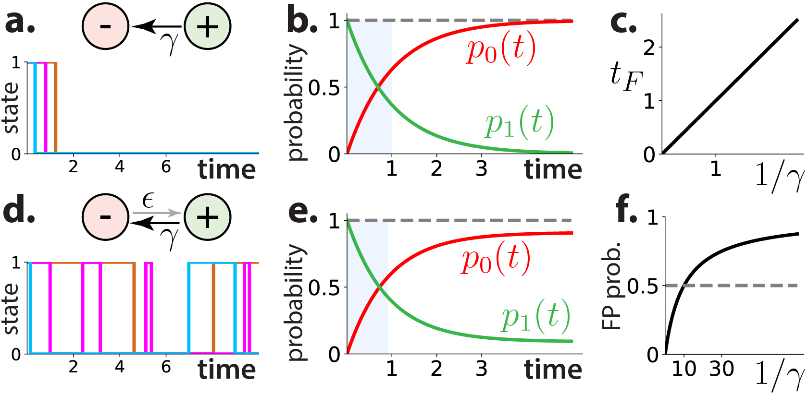
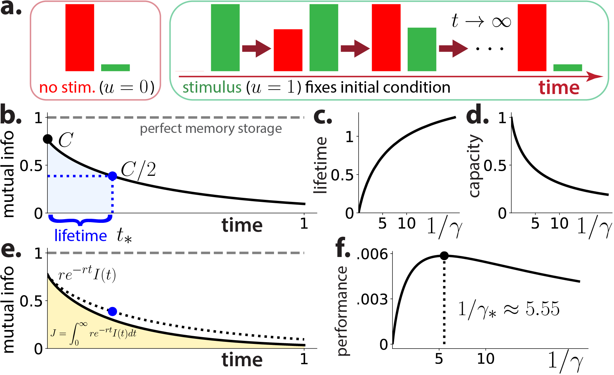
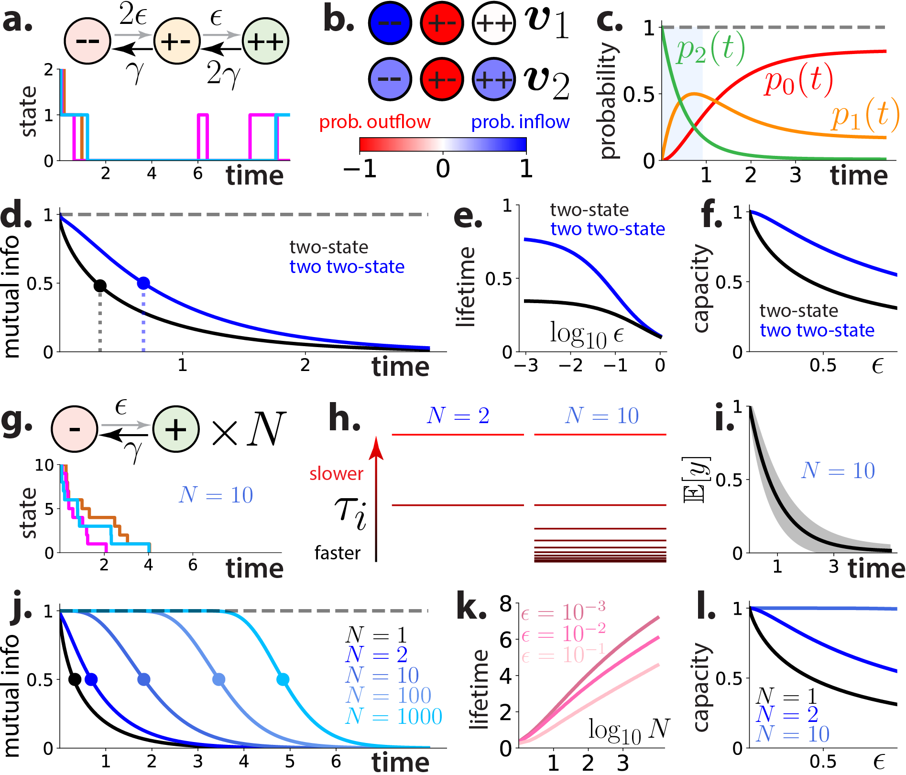
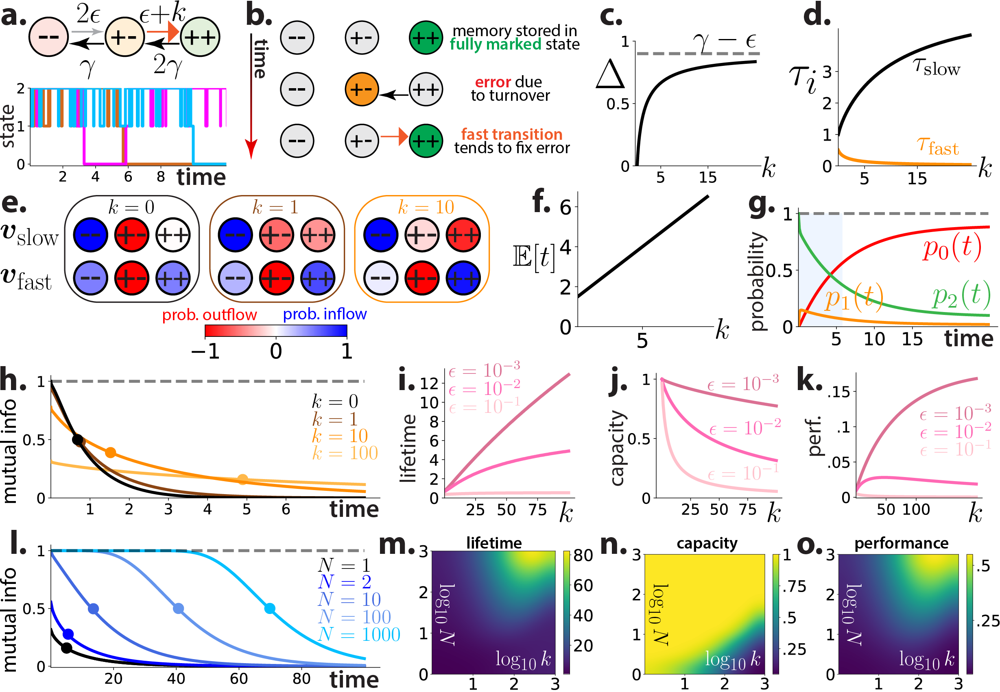

# Storing long-lived memories via molecular error correction: a minimal mathematical model of Crick's memory switch

This repo contains code that reproduces the figures from "**Storing long-lived memories via molecular error correction: a minimal mathematical model of Crick's memory switch**".

**Abstract:**
> Molecular memory storage mechanisms face two serious obstacles: they must be robust to the intrinsic noise characteristic of molecular-scale processes, and they must rely on components (like proteins) whose effective lifetimes are limited for biophysical reasons. For example, if one stores a memory by attaching a post-translational 'mark' to a protein, naively the lifetime of that memory is limited by protein turnover and ambient demarking activity. In this work, we investigate the principles of persistent and noise-robust molecular memory by studying simple mathematical models of protein-marking-state-based memory switches. We pay special attention to two possible strategies for improving memory storage: effectively averaging over noise by using a large number of proteins, and an enzyme-based 'error correction' mechanism first proposed by Francis Crick. Through an exhaustive mathematical analysis of these models, which includes solving most of them exactly, we find that error correction provides an effective mechanism for storing long-lived memories, and that using large populations of proteins only slightly improves the lifetime of stored memories. But we also find that error correction is not always useful, since too much of it can make the probability of false positives excessively high. Our findings lend credence to Crick's proposal, and suggest motifs that may be exploited by potential intracellular memory storage mechanisms. Finally, in addressing these issues, we also provide general insight about how to define memory performance in the molecular setting, as well as associated notions like lifetime and capacity.

Only standard libraries (NumPy, SciPy, and Matplotlib) are used. There is one Jupyter notebook per figure:

**1.** `fig1-intuition.ipynb` Contains code for generating Figure 1, "Turnover and noise as key obstacles for molecular memory".

**2.** `fig2-MI.ipynb` Contains code for generating Figure 2, "Memory performance can be quantified in terms of mutual information".

**3.** `fig3-duplicate.ipynb` Contains code for generating Figure 3, "Increasing the number of switches inefficiently improves performance".

**4.** `fig4-crick.ipynb` Contains code for generating Figure 4, "Crick-like error correction efficiently extends memory lifetime by introducing a slow time scale".

**5.** `fig5-realistic.ipynb` Contains code for generating Figure 5, "Error correction also improves more realistic Crick-like switches".

